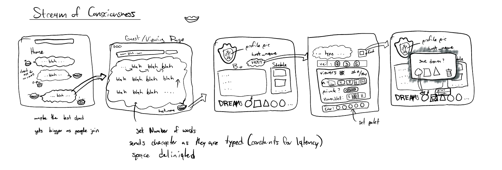

# startup
Website for Web Programming cs260 BYU

Added some notes about Markdown notation [notes](notes.md)

# Stream of Consciousness

## Elevator Pitch

Have you ever been frustrated or in a state of awe, and you want to write down your ideas and thought, maybe share them with your friends, but don't have the energy or time to use formal grammar or even understand where to start? Stream of Consciousness is a social media website that allows you to just write or vent your thoughts as they come to you. You can invite your friends to join a "Dream" which you host and can set parameters called veils on what they can see. You can also just keep your thoughts to yourself to organize later in very own dream journal.

## Design Images

## Key Features

- Ability to host a "Dream" session to stream your thoughts with friends (They see the words as you type them but not the full story)

- Ability to list schedules sessions for hosting "Dream" sessions

- Ability to limit group access to your hosted "Dreams" and profile

- Ability to create independent user data

- Displays of Dream viewer count in real time

## HTML deliverable

For this deliverable I built out the structure of my application using HTML.

- [x] **HTML pages** - 4 HTML pages: representing the Home screen (where the user will have streams recommended for them including a section dedicated to their followed streams), The Profile (where a user can add a description paired with a profile picture to introduce themselves to prospective viewers), a stream page (showing a text box where users hosting a stream can write with controls and comments from people viewing the stream), and an about page with a video embedded and a link to a study regarding the writing process.
- [x] **Links** - From the Home: The login button and sign-up buttons direct the user to a profile page. From the Profile: clicking a past stream will direct the user to a stream page. A header takes the user to either of the four pages and the footer directs the user to my Github repository for startup.
- [x] **Text** - Dream stream are text based with comments also being text based. (I would like to add GIFs instead of text comments in the future with API support)
- [x] **Images** - I included a profile picture example which is a link to a photo hosted on another website. (I would like to add support for uploading a photo for your own profile but didn't know how that would relate to the structure of the page so I just opted to use a placeholder.)
- [x] **Video** - There is an embedded Youtube video in the about section.
- [x] **DB/Login** - Input box and submit button for login. The profile information will be authenticated and stored in a database later. (I would like to add support for blocking and restricting profile and stream access in the form of private streams that require a passkey.)
- [x] **WebSocket** - The count of viewers and comments will be represented with Websocket support.