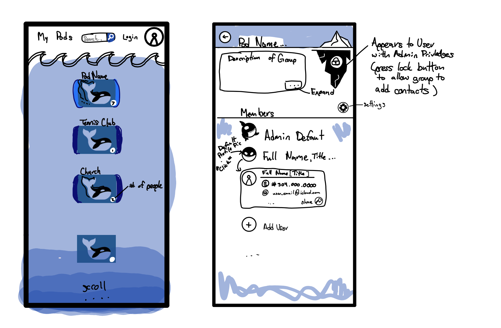
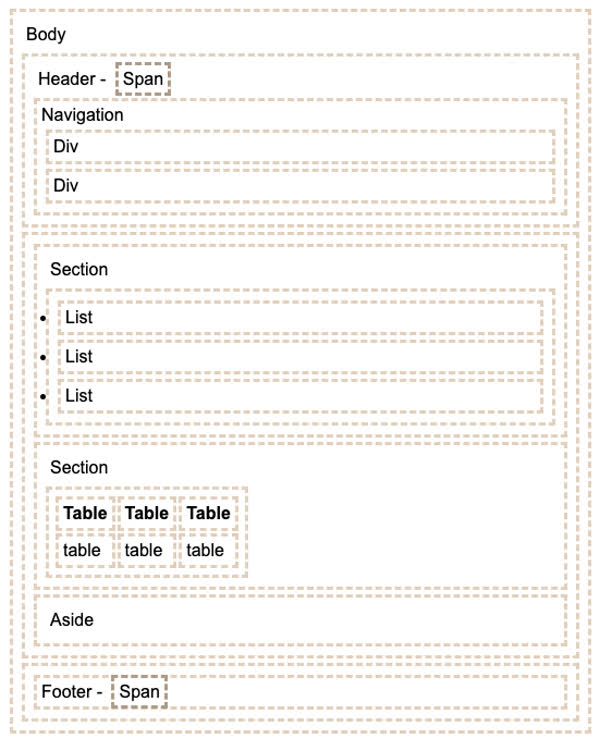

# startup

Hello Github! This is a modification from the CS Lab computer.
Hello CS LAB Computer! This is a modification from Github.
Another github modification!
Collision!

Github git tutorial:
1. Pull the repository's latest changes from GitHub (git pull)
2. Make changes to the code
3. Commit the changes (git commit)
4. Push the changes to GitHub (git push)

5.  If we run the (fetch) Git command, you will get the latest information about the changes on GitHub without actually changing your local repository.
6. We then run the (status) Git command to see the differences between the clones and see that we are missing a commit.

# Contact Pod
## Elevator Pitch

Have you ever needed the ability to quickly make contacts available to a group of people but sending them individually was time-consuming and using the available contact managing applications were tedious and confusing? My Contact application solution, Contact Pod implements a simple modular design that makes sharing contacts with a group (personal info, phone number, email, etc) easy. Users can scroll through their pods to access the contact lists for their different organizations. A "Pod" can vary in permissions to allow scrict, limited, or public access depending on the pod admin specified settings. 



## Key Features:


-Ability to create group for contact sharing

-Ability to limit group contact modifying 

-Ability to create independent user data for easy adding to a group

-Ability to invite App Users to your group

-Display of profile picture to pod members

-Admin control of pod member access to other member info

-Display of Pod member count in real time

-Search of contacts sorted by pod

# Server

ip: 3.138.91.243
ssh -i keyfilepath ubuntu@3.138.91.243

REMINDER: release the elastic ip address before terminating instance for class

#HTML

| element   | meaning                                                                |
| --------- | ---------------------------------------------------------------------- |
| `html`    | The page container                                                     |
| `head`    | Header information                                                     |
| `title`   | Title of the page                                                      |
| `meta`    | Metadata for the page such as character set or viewport settings       |
| `script`  | JavaScript reference. Either a external reference, or inline           |
| `include` | External content reference                                             |
| `body`    | The entire content body of the page                                    |
| `header`  | Header of the main content                                             |
| `footer`  | Footer of the main content                                             |
| `nav`     | Navigational inputs                                                    |
| `main`    | Main content of the page                                               |
| `section` | A section of the main content                                          |
| `aside`   | Aside content from the main content                                    |
| `div`     | A block division of content                                            |
| `span`    | An inline span of content                                              |
| `h<1-9>`  | Text heading. From h1, the highest level, down to h9, the lowest level |
| `p`       | A paragraph of text                                                    |
| `b`       | Bring attention                                                        |
| `table`   | Table                                                                  |
| `tr`      | Table row                                                              |
| `th`      | Table header                                                           |
| `td`      | Table data                                                             |
| `ol,ul`   | Ordered or unordered list                                              |
| `li`      | List item                                                              |
| `a`       | Anchor the text to a hyperlink                                         |
| `img`     | Graphical image reference                                              |
| `dialog`  | Interactive component such as a confirmation                           |
| `form`    | A collection of user input                                             |
| `input`   | User input field                                                       |
| `audio`   | Audio content                                                          |
| `video`   | Video content                                                          |
| `svg`     | Scalable vector graphic content                                        |
| `iframe`  | Inline frame of another HTML page                                      |

##Structure Example Reference:
```html
<body>
  <p>Body</p>
  <header>
    <p>Header - <span>Span</span></p>
    <nav>
      Navigation
      <div>Div</div>
      <div>Div</div>
    </nav>
  </header>

  <main>
    <section>
      <p>Section</p>
      <ul>
        <li>List</li>
        <li>List</li>
        <li>List</li>
      </ul>
    </section>
    <section>
      <p>Section</p>
      <table>
        <tr>
          <th>Table</th>
          <th>Table</th>
          <th>Table</th>
        </tr>
        <tr>
          <td>table</td>
          <td>table</td>
          <td>table</td>
        </tr>
      </table>
    </section>
    <aside>
      <p>Aside</p>
    </aside>
  </main>

  <footer>
    <div>Footer - <span>Span</span></div>
  </footer>
</body>
```

